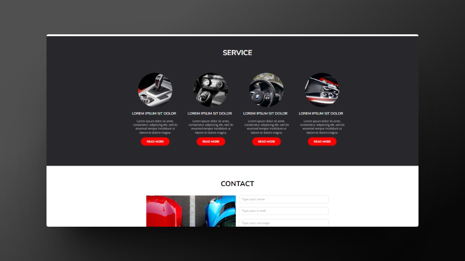

# cl-carsharing - landing page

cl-carsharing is a simple one page webpage made during Coders Lab classes ✍
I used css, flex and html to create it.

## About the Project🚀
Carshering shows an example of landing page.
It has a navigation bar that takes you to individual sections of the page.
Also has a contact form and a checkbox to indicate consent to the use of the data provided.

## Technologies Used✨

## Screenshots💻

    
    
    
    

